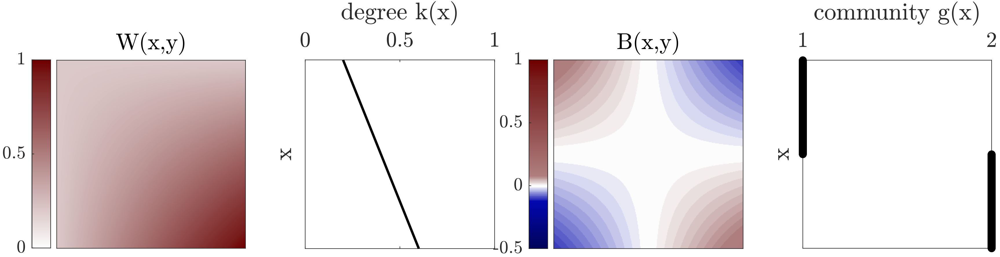

# graphon
Matlab library that allows community detection for graphons with additional Mathematica notebooks to demonstrate analytical approaches for modularity maximisation for graphons.

This code accompanies the paper "Modularity maximisation for graphons" by Florian Klimm, Nick S. Jones, and Michael T. Schaub.
Published in the SIAM Journal on Applied Mathematics [Link](https://doi.org/10.1137/22M1492003) 
[preprint](https://arxiv.org/abs/2101.00503)



## Prerequisites
- Matlab (tested for version R2020a)
- [GenLouvain](https://github.com/GenLouvain/GenLouvain) for community detection (tested for version 2.2)
- Non-essential: (deconvtv for sort-and-smooth graphon estimation from [SAS](https://github.com/airoldilab/SAS))

## How-to

### Matlab
The code in the library allows you to construct synthetic graphons and use a modularity-maximisation algorithm to detect their community structure.

The simplest use case is
```Matlab
%% Community detection for synthetic graphon
% 0) Set some parameters
n=2000; % number of discretisation steps
lambda=0.2; % lambda parameter in [0,1]

% 1) Construct a graphon
[W] = LambdaGraphon(n,lambda);

% 2) Community detection on it
% a) compute the modularity matrix
[B] = modularityGraphon(W);

% b) find the optimal group structure with the GenLouvain algorithm
[S,Q] = genlouvain(B);
Q = Q/sum(sum(W))
```

To reproduce the figures in the manuscript, see folder `/matlab/paperReproduction`.

The code to construct synthetic graphons is available in `/matlab/graphonConstruction`.

Different graphon metrics are available under `/matlab/graphonFunctions`.

Some helper functions (e.g., colourmaps for plotting) are under `/matlab/helperFunctions`.

### Mathematica

The Mathematica notebooks demonstrate how sliver optimisation can be used to derive analytical expressions of the optimal community structure for some synthetic graphons.
