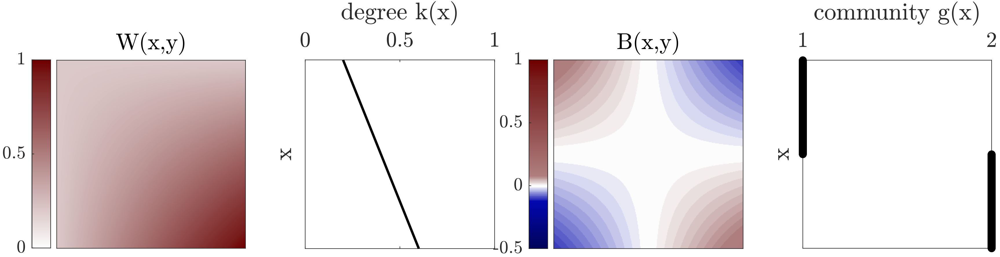

# graphon
Matlab library for community detection in graphons

This code accompanies the paper "Modularity maximisation for graphons" by Florian Klimm, Nick S. Jones, and Michael T. Schaub.

You will soon find a preprint of this paper on arXiv.

## Prerequisites
- Matlab (tested for version R2020a)
- [GenLouvain](https://github.com/GenLouvain/GenLouvain) for community detection (tested for version 2.2)
- Non-essential: (deconvtv for sort-and-smooth graphon estimation from [SAS](https://github.com/airoldilab/SAS))

## How-to

### Matlab
The code in the library allows you to construct synthetic graphons and use a modularity-maximisation algorithm to detect community structure in them. It also has some examples of graphons estimated from empirical network data.

To reproduce the figures in the manuscript, see folder `/matlab/paperReproduction`.

The code to construct synthetic graphons is available in `/matlab/graphonConstruction`.

Different graphon metrics are available under `/matlab/graphonFunctions`.

Some helper functions (e.g., colourmaps for plotting) are under `/matlab/helperFunctions`.

### Mathematica

The Mathematica notebooks demonstrate how sliver optimisation can be used to derive analytical expressions of the optimal community structure for some synthetic graphons.
